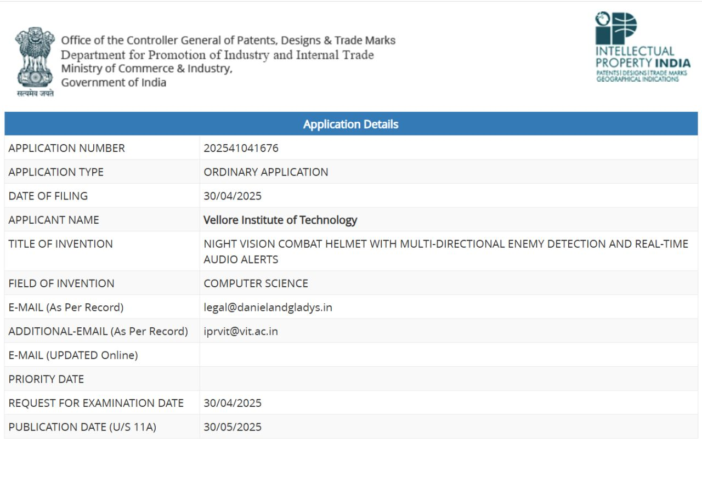
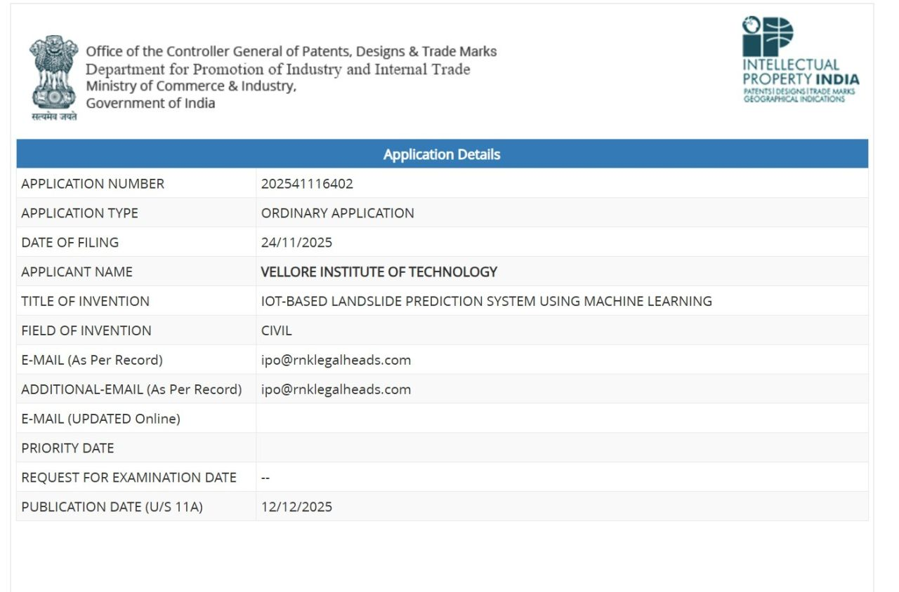

# Hi there, I'm Arunbalaji M 👋

### AI/ML Engineer | Deep Learning | Computer Vision | Generative AI

I'm an M.Tech AIML student at **Vellore Institute of Technology**, passionate about building intelligent systems — from fine-tuning LLMs and designing multi-agent pipelines to deploying computer vision models on edge devices. I enjoy turning research ideas into working, deployable AI solutions.

---

## 🎓 Education

| Degree | Institution | CGPA |
|--------|-------------|------|
| M.Tech CSE (AI & ML) — 2025–2027 | Vellore Institute of Technology | 7.88 |
| B.Tech ECE — 2021–2025 | Vellore Institute of Technology | 8.14 |

---

## 🛠️ Tech Stack

**Languages**

**ML / DL Frameworks**

**Data Science**

**Deployment & Tools**

---

## 🚀 Featured Projects

### 🫁 [Chest X-Ray Lung Disease Detection](https://github.com/arunbalaji20-dev/chest-xray-lung-disease-detection)
> DenseNet + Grad-CAM + Modified YOLOv11 for TB & Pneumonia classification and localization
- 96.67% classification accuracy with fine-tuned DenseNet
- Grad-CAM explainability highlighting clinically significant lung regions
- Custom YOLOv11 achieving 91% detection accuracy

---

### 🏦 LLM-Integrated Multi-Agent Banking Platform
> Mistral-7B · LoRA · XGBoost · FastAPI · React
- Fine-tuned Mistral-7B with LoRA for banking intent routing
- 98.54% loan eligibility accuracy (AUC 0.9993)
- 99.33% fraud detection accuracy (AUC 0.9996)

---

### 🤖 Multi-Agent Customer Support AI
> LLaMA · RAG · ResNet · Tesseract OCR · FastAPI
- RAG-based conversation handling with vision agent for product damage detection
- Document agent for invoice/warranty extraction to automate refund decisions

---

## 📜 Patents Filed

### 🪖 Night Vision Smart Helmet with Multi-Directional Situational Awareness
`Application No: 202541041676` | **April 2025**
- YOLOv8 deployed on Raspberry Pi with infrared camera — **96% accuracy** for low-light human detection
- Real-time directional audio alerts using pyttsx3 TTS

> 📄 *Patent publication image below:*
> 
> 

---

### 🌍 IoT-Based Landslide Prediction System Using Machine Learning
`Application No: 202541116402` | **December 2025**
- Ensemble ML + LSTM on IoT time-series data for landslide risk prediction
- Real-time Flask API + Telegram Bot alert system

> 📄 *Patent publication image below:*
>
> 

---

## 💼 Internship

**Titan Engineering & Automation Limited** — Hosur, Tamil Nadu
`Aug 2023 – Sep 2023`

---

## 📊 GitHub Stats

---

## 📫 Connect With Me

